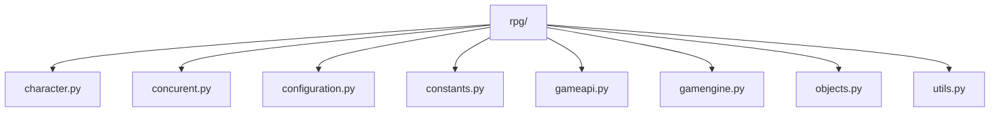
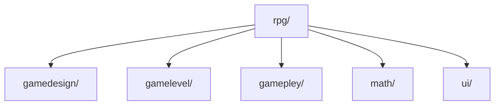
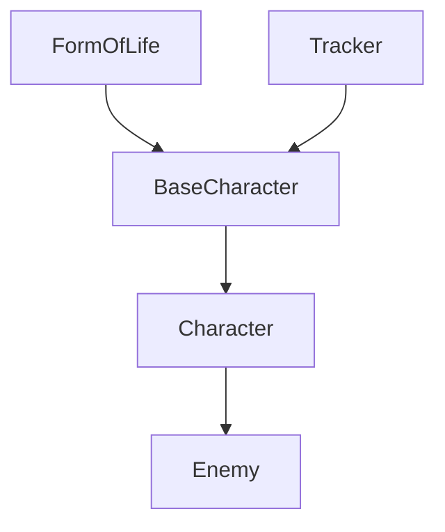

# **Source Code - Diagrams** 

## Submodules from rpg/

```mermaid
graph TD;
    rpg/-->character.py;
    rpg/-->concurent.py;
    rpg/-->configuration.py;
    rpg/-->constants.py;
    rpg/-->gameapi.py;
    rpg/-->gamengine.py;
    rpg/-->objects.py;
    rpg/-->utils.py;
```

## Submodules from rpg/

```mermaid
graph TD;
    rpg/-->gamedesign/;
    rpg/-->gamelevel/;
    rpg/-->gamepley/;
    rpg/-->math/;
    rpg/-->ui/;
```

## characters.py

```mermaid
graph TD;
    FormOfLife --> BaseCharacter
    Tracker --> BaseCharacter
    BaseCharacter --> Character;
    Character --> Enemy;
```